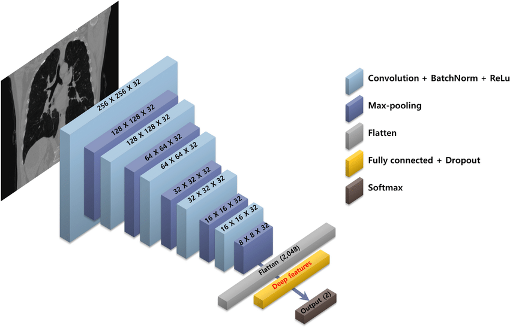

<h1 align="center">AI Road-map</h1>

**Introduction**

This comprehensive roadmap outlines a learning path for aspiring data scientists, guiding you from foundational concepts to advanced techniques. It's structured into three levels: Beginner, Intermediate, and Advanced. Each level is estimated to take a specific time-frame, but remember, the pace of learning depends on your dedication and prior knowledge.

This document also serves as a README file to accompany your Data Science learning journey, offering resources and suggestions for further exploration. Feel free to tailor this roadmap to your personal needs and interests.

**Enhancing Your Learning Experience:**

- **Set realistic goals:** Break down each level into smaller, achievable objectives.
- **Practice consistently:** Allocate dedicated time for practicing with tutorials and projects.
- **Join online communities:** Connect with other learners and experts for support and guidance.
- **Work on personal projects:** Apply your skills to real-world problems to solidify your understanding.

---

> For Datacamp courses we have access to it, if you don’t: 

     <li> Github student pack gives you free access for 3 months. 

`You can google it, if you want more details`

### Roadmap Overview:

The track is divided into three phases:

1. **Beginner** - Basic understanding of data analysis, tools, and techniques.
2. **Intermediate** - Deeper dive into more complex topics like Machine Learning (ML), Mathematics, and Data Engineering.
3. **Advanced** - Advanced topics in Mathematics, Deep Learning (DL), and Deployment.

---

## Beginner Phase

> **Estimated Time**: 1 - 1.5 months

1. **Python** 

   - [Basics](https://www.udacity.com/course/introduction-to-python--ud1110) - Udacity 
   - [OOP](https://learn.datacamp.com/courses/object-oriented-programming-in-python) - Datacamp 
   - [Tutorial](https://learnpython.org/) - Learn Python

2. **Descriptive Statistics** 

   - [Course](https://www.youtube.com/watch?v=MXaJ7sa7q-8&list=PL0KQuRyPJoe6KjlUM6iNYgt8d0DwI-IGR) - YouTube 
   - [Course](https://www.udacity.com/course/intro-to-descriptive-statistics--ud827) - Udacity 

3. **NumPy** 

   - [FreeCodeCamp Tutorial](https://www.youtube.com/watch?v=QUT1VHiLmmI&t=1s) 
   - [CS231n Tutorial](http://cs231n.github.io/python-numpy-tutorial/) 
   - [Huawei Talent Numpy Guide](https://drive.google.com/file/d/1cdYROgc7D9zXmkjWRbq16POyDFI5JzSH/view?usp=sharing) 
   - [Official Documentation](https://numpy.org/doc/1.18/user/quickstart.html) - (recommended)  

4. **Pandas** 

   - [Kaggle Tutorial](https://www.kaggle.com/learn/pandas) 
   - [YouTube Playlist - Corey Schafer ](https://www.youtube.com/watch?v=ZyhVh-qRZPA&list=PL-osiE80TeTsWmV9i9c58mdDCSskIFdDS) 
   - [DataCamp Course](https://learn.datacamp.com/courses/data-manipulation-with-pandas) 
   - [Documentation](https://pandas.pydata.org/pandas-docs/version/0.15/tutorials.html) 

5. **Data Cleaning**

   > _One of the most critical skills for a data scientist._

   - [Guide](https://towardsdatascience.com/the-ultimate-guide-to-data-cleaning-3969843991d4) - Medium 
   - [DataCamp Course](https://www.datacamp.com/courses/cleaning-data-in-python) 
   - [Kaggle Data Cleaning Course](https://www.kaggle.com/learn/data-cleaning) 

6. **Data Visualization** 

   - [Matplotlib](https://www.youtube.com/playlist?list=PL-osiE80TeTvipOqomVEeZ1HRrcEvtZB_) - YouTube 
   - [Seaborn Intro](https://learn.datacamp.com/courses/introduction-to-data-visualization-with-seaborn) - DataCamp 
   - [Seaborn Intermediate](https://learn.datacamp.com/courses/intermediate-data-visualization-with-seaborn) - DataCamp 
   - [Data Visualization with Python](https://www.coursera.org/learn/understanding-visualization-data) - Coursera 

7. **Exploratory Data Analysis (EDA)** 

   - [Course](https://learn.datacamp.com/courses/exploratory-data-analysis-in-python) - DataCamp 
   - [Kaggle Notebook Example](https://www.kaggle.com/bandiatindra/telecom-churn-prediction) 

8. **SQL and Databases** 

   - [Introduction to SQL](https://learn.datacamp.com/courses/introduction-to-sql) - DataCamp 
   - [Relational Databases](https://learn.datacamp.com/courses/introduction-to-relational-databases-in-sql) - DataCamp 

9. **Regular Expressions (Regex)** 

   - [Tutorial](https://www.datacamp.com/community/tutorials/python-regular-expression-tutorial) - DataCamp 

10. **Common Tools** 

- [Git Book](https://git-scm.com/book/en/v2) 
- [Udacity Git Course](https://www.udacity.com/course/version-control-with-git--ud123)

**End of Beginner Phase**  
_Apply all the skills you’ve learned on a project._

---

## Intermediate Phase

> **Estimated Time**: 2 - 3 months

1. **Advanced Statistics** 

   - [Think Stats Book](https://b-ok.africa/book/2737548/7659e9) 
   - [Think Bayes Book](https://b-ok.africa/book/2737587/ab97d5) 
   - [Probability Theory Course](https://www.coursera.org/learn/probability-theory-statistics) - Coursera 

2. **Time Series Analysis** 

   - [DataCamp Track](https://learn.datacamp.com/skill-tracks/time-series-with-python) 
   - [Prophet Docs](https://facebook.github.io/prophet/docs/quick_start.html) 

3. **APIs** 

   - [DataQuest API Tutorial](https://www.dataquest.io/blog/python-api-tutorial/) 
   - [Medium Blog](https://medium.com/how-to-pull-data-from-an-api-using-python-requests) 

4. **Web Scraping & APIs** 

   - [DataCamp Course](https://learn.datacamp.com/courses/web-scraping-with-python) 
   - [BeautifulSoup Tutorial](https://realpython.com/beautiful-soup-web-scraper-python/) 

5. **Advanced SQL** 

   - [Joining Data in PostgreSQL](https://learn.datacamp.com/courses/joining-data-in-postgresql) - DataCamp 
   - [Intermediate SQL](https://learn.datacamp.com/courses/intermediate-sql) - DataCamp 

6. **Math for ML** 

   - [Mathematics for ML Specialization](https://www.coursera.org/specializations/mathematics-machine-learning) - Coursera 
   - [Linear Algebra](https://www.youtube.com/playlist?list=PLZHQObOWTQDPD3MizzM2xVFitgF8hE_ab) - YouTube 

7. **Machine Learning** 
   - [Intro to ML](https://www.coursera.org/learn/machine-learning) - Coursera 
   - [Kaggle ML Track](https://learn.datacamp.com/career-tracks/machine-learning-scientist-with-python?version=1) - DataCamp 

**End of Intermediate Phase**  
_Apply these skills on 2 - 3 projects._

---

## Advanced Phase

> **Estimated Time**: 2 - 3 months

1. **Advanced Statistics** 

   - [Inferential Stats Specialization](https://www.coursera.org/specializations/statistics-with-python) - Coursera 
   - [Bayesian Statistics](https://www.coursera.org/learn/bayesian-statistics) - Coursera 

2. **Deep Learning** 

   - [Coursera DL Specialization](https://www.coursera.org/specializations/deep-learning) 
   - [D2L Book](https://d2l.ai/d2l-en.pdf) 

3. **NLP** 

   - [Coursera NLP Specialization](https://www.coursera.org/specializations/natural-language-processing) 

4. **Model Deployment** 
   - [Deploying a Model with Flask](https://towardsdatascience.com/deploying-a-deep-learning-model-using-flask-3ec166ef59fb) - Medium 
   - [TensorFlow Deployment Specialization](https://www.coursera.org/specializations/tensorflow-data-and-deployment) 

**Note:** This roadmap can be expanded further as you progress.

---
