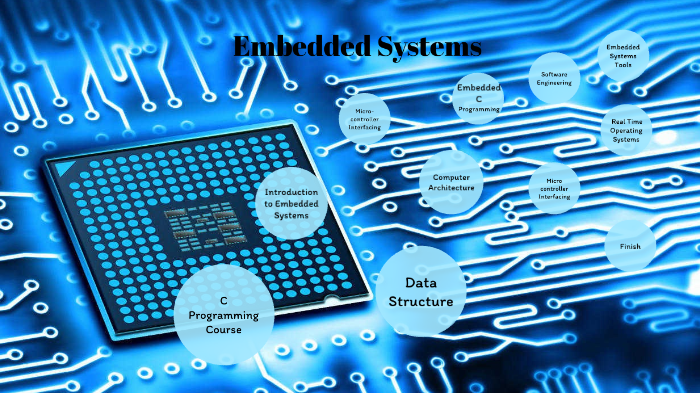
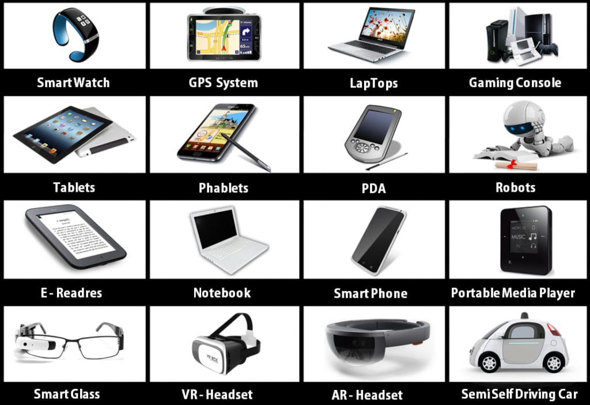

# ***Embedded-Systems-Roadmap***

Welcome to the Embedded Systems Branch Roadmap! Within this guide, you’ll discover essential core topics along with suggested courses.
> Notice that any roadmap is not sacred. You may find better alternatives to the suggested courses from your perspective. However, this roadmap contains all the core topic and you should go through all of them.

## 💻 What is an Embedded System?
### An embedded system is a combination of computer hardware and software designed for a specific function.
Unlike general-purpose computers, such as laptops or desktops, embedded systems are typically built to execute specific functions with a focus on efficiency, reliability, and often in real-time.

## 💻 Embedded Systems Applications?

# Contents
- [Beginner Level](#beginner-level)
- [Intermediate Level](#intermediate-level)
- [Advanced Level](#advanced-level)
- [Recommended Needs](#recommended-needs)
- [References](#references)
 
---
---
---

# Beginner Level
- [C Programming](#c-programming)
- [Data Structure](#data-structure)
- [Algorithm](#algorithm) 
- [Projects](#projects)

## C Programming

Go with two Courses together:
-  [Team content (Board 2022)](https://drive.google.com/drive/folders/1Dc5OaEO962Nb48E1gniO3aY3p_Sw-6Nd?usp=drive_link)

-  [Neso Academy](https://www.youtube.com/playlist?list=PLBlnK6fEyqRggZZgYpPMUxdY1CYkZtARR)

**Note :**
Beside these matierial, it is recommended to read the chapter(s) of each topic from [C_How_to_Program_7th_Edition_by_Paul_Dei](https://drive.google.com/file/d/1u3x4TYab9vQHsqTs5a2xWCDSnc-vImI1/view?usp=drive_link)   **OR**  [C Programming: A Modern Approach by K N King](https://drive.google.com/file/d/18pLjNvcf7OJhg01fVJITXdvKFAuemAuF/view?fbclid=IwAR0z59u7lvfRmpgWF45GDmn38kVd0uNycTvE511CuYRbMVq1Jv72rc7wYIg)

Another useful Resources

- [Microcontroller Embedded C](https://www.udemy.com/course/microcontroller-embedded-c-programming/)
- [MycodeSchool: Pointers in C/C++](https://www.youtube.com/playlist?list=PL2_aWCzGMAwLZp6LMUKI3cc7pgGsasm2_)
- [Understanding and Using C Pointers: Core Techniques for Memory Management by Richard M. Reese](https://drive.google.com/file/d/1L_9Sg2q89R6AQEuDJvFQI-AmhCbsNRkV/view?usp=sharing)
<!-- - [C with kerolos ](https://www.udemy.com/course/microcontroller-embedded-c-programming/)-->

## Data Structure
Here, we will learn the basic data structures  `stacks`, `queues`, `lists`, `trees` and how to impelement them in C.

Course:
- [CS214: Data Structures](https://www.youtube.com/playlist?list=PLoK2Lr1miEm-5zCzKE8siQezj9rvQlnca) ([Assignments](https://github.com/DrWaleedAYousef/Teaching/tree/master/DataStructures?fbclid=IwAR3mPu1dgR9lheko7pB0nXW_3lfa3qxGlUJxko3b-CsShx9D3KSWTFOLnsE), [Book](https://drive.google.com/file/d/1b_Aro-jMLiIe9IUqE8FgcCVsTeoabksd/view?fbclid=IwAR0lJVT1HUcrlaIm0Dw7lPcssqzuI5rnO4oC4F9yg83ycO0SVtp5h7hmLd4))

### 📃 Data Structure Articles:-
- [Linked List](https://www.geeksforgeeks.org/data-structures/linked-list/)
- [Stack](https://www.geeksforgeeks.org/introduction-to-stack-data-structure-and-algorithm-tutorials/)
- [Queue](https://www.geeksforgeeks.org/queue-data-structure/)
- [Hash Table](https://www.tutorialspoint.com/data_structures_algorithms/hash_data_structure.htm) 
 

## Algorithm 
**Algorithms are the heart of computer science, and the subject has countless practical applications as well as intellectual depth.**
Here, we will learn about `asymptotic analysis` `Divide-and-conquer basics` `Searching techniques` `Sorting techniques`

Courses:
- [Intro to Algorithm](https://www.youtube.com/playlist?list=PLIHnBIU7Birg7x868_ucmUcy6ohMCgMxM).
- [Sorting Algorithms](https://www.youtube.com/watch?v=pkkFqlG0Hds&list=PL2_aWCzGMAwKedT2KfDMB9YA5DgASZb3U)
- [Searching Algorithm](https://www.youtube.com/watch?v=j5uXyPJ0Pew&list=PL2_aWCzGMAwL3ldWlrii6YeLszojgH77j)

Another recommended course [Stanford course at coursera](https://www.coursera.org/learn/algorithms-divide-conquer?specialization=algorithms#syllabus).

**🔴Note :**
Beside these matierial, it is recommended to read the chapter(s) of each topic from [Grokking Algorithms Book](https://drive.google.com/file/d/1TIToCrGpf5FPk3Njxo6yjbxg727IASX6/view?usp=sharing)

## Projects
There are some suggested C projects.
- [Breakfast Machine](https://drive.google.com/file/d/1krc5wWEEQCxXrk_RKKZr4EXt6DSfgWdn/view)
- [Library management system](https://drive.google.com/file/d/1za4RDBhHP5-f2omYFkkJTGSur0Trti-Z/view) 
<!--- [Student System Record](https://drive.google.com/file/d/1G6d5u4RAeCquRJj-CYL04ESjOv4DDs8D/view?fbclid=IwAR1s_hTaCaMoOz5moxizFLt-zF7zizETbyYcyX8IMGsq_fkAjWPlzYe8vpw)
- [Payment Application](https://docs.google.com/document/d/13wQxfnEIRgrSuv0ZBfRaBNXUcO3Xk5kqtx8MJtn5SWs/edit?fbclid=IwAR0kwUSN4tz2OUQ_In5d_fKScrCclV18CLoi6F-EZGcAp-joDEqR_FcoZFk#) -->
 

---
---

# Intermediate Level
In this level we'll be able to interface with microcontrollers starting with AVR.

- [Digital Design](#digital-design)
- [Elctronics](#electronics)
- [MCU Architecture](#mcu-architecture)
- [Memory](#memory)
- [Compilation Process](#compilation-process)
- [MCU interfacing](#mcu-interfacing)
- [Embedded Software Design](#embedded-software-design) 

## Digital Design
- [Neso Academy](https://youtube.com/playlist?list=PLBlnK6fEyqRjMH3mWf6kwqiTbT798eAOm&si=urO34c44rbM0qUgh)

## Elctronics
- [Eng.Mohamed Adel | Electronics_Intro session](https://drive.google.com/drive/folders/10N5wlym_QgoNAPvpUyWBp1R0lODdprDS?usp=drive_link).
- [Walid Essa | electronics](https://www.youtube.com/playlist?list=PLww54WQ2wa5rOJ7FcXxi-CMNgmpybv7ei).

## MCU Architecture
We will learn about `Processor Internal Structure`
 `Processor Execution Steps(Fetch, Decode, Execute)`
 `(OS  vs  Bare Metal, Van Neumann vs Harvard, CISC vs RISC)` 
 `MCU Clocks(Clock Source)`.

Resources :-
- [Eng.Mohamed Adel | EmbeddedSystem_Concept session](https://drive.google.com/drive/folders/10oxIu6RjtplNRlwJdgzsmW2iuq6fh_tx?usp=drive_link)
- [Eng.Mohsen youssif & Eng.Ahmed Maged | Video(1,2) in playlist](https://youtube.com/playlist?list=PLEPINOrvANGfVTricxFp5PW6xCaQ7H1gZ&si=-jqfTF-PYYlf2EiE)

## Memory
We will learn about `Mcu Memory Types`

Resources :-
- [Eng.Mohamed Adel | Memory session](https://drive.google.com/drive/folders/11GT4fK-gLe-fsklhrpep6Pkk6_4RDfx9?usp=drive_link)
- [Eng.Ahmed Maged | Video(3,4) in playlist](https://youtube.com/playlist?list=PLEPINOrvANGfVTricxFp5PW6xCaQ7H1gZ&si=-jqfTF-PYYlf2EiE)

## Compilation Process
Here , we will explore the process of obtaining the executable file from our source code, delve into each step involved, and gain insights into intriguing concepts like the `preprocessor`, `compiler`, `linker`, `toolchain`, and `memory sections`, among others.

Resources :-
- [Eng.Mohsen youssif  | playlist](https://youtube.com/playlist?list=PLEPINOrvANGdilPO9q6TymvxN9f-_tGRh&si=fVlZ3_Id1lhB0C4I)

## MCU interfacing
Here, we will learn about `DIO` `Interuppt` `ADC` `Timers` `Communication Protocols`

Courses:
- [Eng.Haidy Hossam | AVR_Interface ](https://drive.google.com/drive/folders/110KFHClsgv-ESUuqVpWBx06DglxJBX__?usp=drive_link)
- [AVR | YouTube Course](https://youtube.com/playlist?list=PLoiqjtgvXf9e2VJk8GWEXwECPM_7JRwkE&si=5jqlyTfBjCmj_OOe)
- [NTI Course]() 
- [ITI Course]()

**🔴Note :**
- The main reference during this stage should  be from 
    - [AVR DataSheet](https://drive.google.com/file/d/1DUvx0uRzz2CB02DUkOhZvoW8ZauMWYg8/view?usp=sharing)

- Beside these matierial, it is recommended to read the chapter(s) of each topic from 
    -  [AVR MAZIDI Book](https://drive.google.com/file/d/1cs9Ege67z89aa7BaEmdAnm4dOVoHqiid/view?usp=sharing) starting from chapter 7.
    - [An Embedded Software Primer](https://drive.google.com/file/d/1BCddCZ_LizPQoFMy7FRS3AHiuXbTTqaO/view?usp=sharing) (Chapters 1-4, 9, 10).

## Embedded Software Design 
Here, we will Understand embedded software design and its different aspects
- [Amr Ali Session ](https://youtu.be/EZkctJSefb4?si=3b8tlDSkeWrp1iPK)

----
----

# Advanced Level
- [FreeARTOS](#freeartos)
- [ARM Microcontroller](#arm-microcontroller)

## FreeARTOS

**Mastering RTOS: Hands on FreeRTOS and STM32Fx with Debugging**
  - ["DIY RTOS Made Easy: Mastering Microcontrollers"](https://www.udemy.com/course/mastering-rtos-hands-on-with-freertos-arduino-and-stm32fx/?id=*fXwwmOZxWA&mid=39197&u1=120189_&murl=https%3A%2F%2Fwww.udemy.com%2F&ranMID=39197&ranEAID=*fXwwmOZxWA&ranSiteID=.fXwwmOZxWA-VtoJNgAz23urBEor5hzarw&LSNPUBID=*fXwwmOZxWA&utm_source=aff-campaign&utm_medium=udemyads)

## ARM Microcontroller

 **Embedded Systems Programming on ARM Cortex-M3/M4 Processor**
  - [Embedded Systems Programming on ARM Cortex-M3/M4 Processor](https://www.udemy.com/course/embedded-system-programming-on-arm-cortex-m3m4/?id=*fXwwmOZxWA&mid=39197&u1=120189_&murl=https%3A%2F%2Fwww.udemy.com%2F&ranMID=39197&ranEAID=*fXwwmOZxWA&ranSiteID=.fXwwmOZxWA-PWoYcyOYAyXaYXGjuAJSGw&LSNPUBID=*fXwwmOZxWA&utm_source=aff-campaign&utm_medium=udemyads)
  - [Definitive Guide to ARM Cortex ](https://drive.google.com/file/d/1ZFaCwmt5XWJc8XiIdeZFbBmU0jystiVd/view?usp=sharing)(Chapters 1, 4-7)

 **Mastering Microcontroller and Embedded Driver Development**
   - [Mastering Microcontroller and Embedded Driver Development](https://www.udemy.com/course/mastering-microcontroller-with-peripheral-driver-development/?id=*fXwwmOZxWA&mid=39197&u1=120189_&murl=https%3A%2F%2Fwww.udemy.com%2F&ranMID=39197&ranEAID=*fXwwmOZxWA&ranSiteID=.fXwwmOZxWA-EVU5BQ8ssnr4_csYvFyQzQ&LSNPUBID=*fXwwmOZxWA&utm_source=aff-campaign&utm_medium=udemyads) 

**Mastering Microcontroller:Timers,PWM,CAN ,  Low Power(MCU2)**
  - [Embedded Systems Programming on ARM Cortex-M3/M4 Processor](https://www.udemy.com/course/microcontroller-programming-stm32-timers-pwm-can-bus-protocol/?id=*fXwwmOZxWA&mid=39197&u1=120189_&murl=https%3A%2F%2Fwww.udemy.com%2F&ranMID=39197&ranEAID=*fXwwmOZxWA&ranSiteID=.fXwwmOZxWA-e2LcQBbdBuLVWuNk2_Ij1w&LSNPUBID=*fXwwmOZxWA&utm_source=aff-campaign&utm_medium=udemyads)

---
---

# Recommended Needs
- [Problem Solving](#problem-solving)
- [Introduction to Git and GitHub](#introduction-to-git-and-github)

## Problem Solving
***It is a Powerful Skill you should have.***

## Introduction to Git and GitHub

 

 First,what is the difference between Git and GitHub?  - [see this](https://devmountain.com/blog/git-vs-github-whats-the-difference/)

You can learn about them from these resources:
- [Git and GitHub | شخبط وانت متطمن](https://www.youtube.com/watch?v=Q6G-J54vgKc&t=7346s&ab_channel=%D8%A8%D8%A7%D9%84%D8%B9%D8%B1%D8%A8%D9%8ABigData)   
-  [The most common commands in git.](https://docs.google.com/document/d/e/2PACX-1vRsH5CE2ty2BzWys6bsTfJ8sYDrNg0yBy8rrVU2jWhr3QbJ1YHdXgPwZbAuf04hz-YSrjIbBkjIPABx/pub)
- [Pro Git](https://drive.google.com/file/d/13h9CWcrnBwbLKcRTr4-ypcy0rawzbvYY/view?usp=sharing)

# References

- [C_How_to_Program_7th_Edition_by_Paul_Dei](https://drive.google.com/file/d/1u3x4TYab9vQHsqTs5a2xWCDSnc-vImI1/view?usp=drive_link)

- [C Programming: A Modern Approach by K N King](https://drive.google.com/file/d/18pLjNvcf7OJhg01fVJITXdvKFAuemAuF/view?fbclid=IwAR0z59u7lvfRmpgWF45GDmn38kVd0uNycTvE511CuYRbMVq1Jv72rc7wYIg)
 
 - [Understanding and Using C Pointers: Core Techniques for Memory Management by Richard M. Reese](https://drive.google.com/file/d/1L_9Sg2q89R6AQEuDJvFQI-AmhCbsNRkV/view?usp=sharing)

 - [Data Structure and Program Design in C](https://drive.google.com/file/d/1b_Aro-jMLiIe9IUqE8FgcCVsTeoabksd/view?fbclid=IwAR0lJVT1HUcrlaIm0Dw7lPcssqzuI5rnO4oC4F9yg83ycO0SVtp5h7hmLd4) 
 
 - [Grokking Algorithms](https://drive.google.com/file/d/1TIToCrGpf5FPk3Njxo6yjbxg727IASX6/view?usp=sharing)

 - [AVR DataSheet](https://drive.google.com/file/d/1DUvx0uRzz2CB02DUkOhZvoW8ZauMWYg8/view?usp=sharing)
 
 - [AVR MAZIDI](https://drive.google.com/file/d/1cs9Ege67z89aa7BaEmdAnm4dOVoHqiid/view?usp=sharing)
 
 - [An Embedded Software Primer](https://drive.google.com/file/d/1BCddCZ_LizPQoFMy7FRS3AHiuXbTTqaO/view?usp=sharing)
 
 - [Definitive Guide to ARM Cortex ](https://drive.google.com/file/d/1ZFaCwmt5XWJc8XiIdeZFbBmU0jystiVd/view?usp=sharing)
 
 - [Pro Git](https://drive.google.com/file/d/13h9CWcrnBwbLKcRTr4-ypcy0rawzbvYY/view?usp=sharing)

 ---

